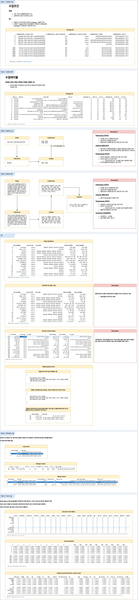
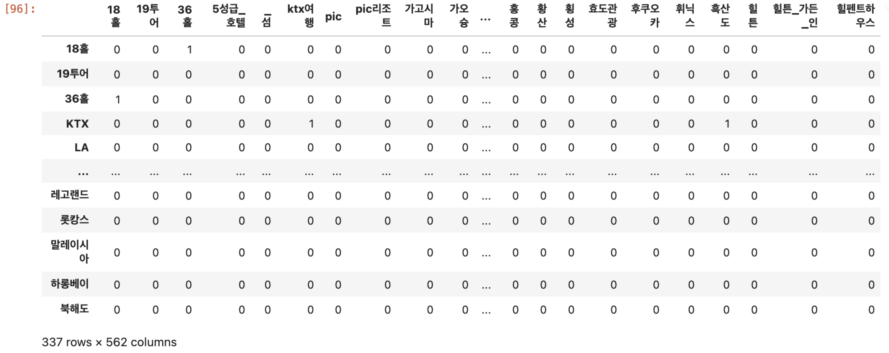
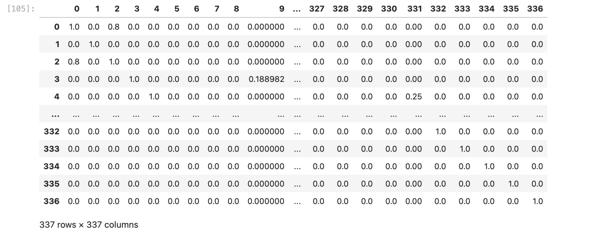
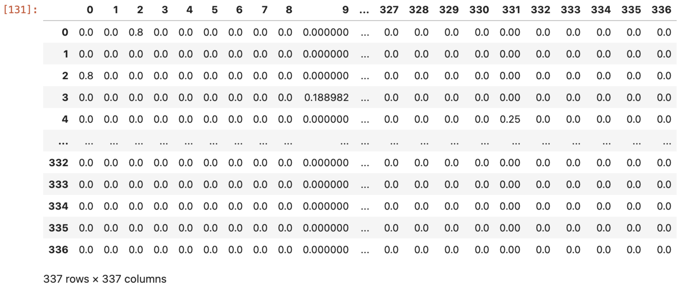

# 연관검색어와 추천검색어
## 연관검색어
검색 사용자의 `검색의도를 파악`하여 적합한 검색어 제공을 통해   
이용자 여러분이 더욱 편리하게 정보 탐색을 할 수 있도록 지원하는 서비스

## 추천검색어
이용자들이 보다 편리하게 자신이 원하는 상품 또는 서비스를 제공하는 업체를 찾을 수 있도록 이용자가 검색한 키워드를 기반으로  `해당 상품 또는 서비스와 관련이 있는 검색어를 제안`하는 서비스

|   | 연관검색어  | 추천검색어  |
|---|---|---|
|대상|모든분야|비지니스 연관분야|
|정의|다양한 검색어와 콘텐츠를 분석하여 검색 사용자의 검색 의도를 파악한 후, 적합한 검색어를 제공|이용자의 검색 의도를 파악하여 특정 키워드를 입력한 이용자가 궁금해 할만한 검색어를 노출|
|방식|특정 단어 검색 이후 많이 검색한 검색어를 연관 검색어로 노출|특정 단어에 대한 검색어를 로직에 따라 선정하여 검색어 노출|
|예시|**다낭 여행**, **다낭 패키지** 등 사용자가 입력한 검색어에 이어 검색 범위를 좁혀 검색할 키워드를 나열|**베트남 여행**, **베트남 맛집** 등 사용자가 입력한 검색어와 관련있는 키워드를 나열|

# 프로세스

##  BoW(Bag of Word) Train 프로세스
어휘의 빈도수에 대해 통계적 언어 모델을 적용해서 나타낸것. 단어들의 순서는 전혀 고려하지 않고, `단어들의 출현 빈도(frequency)에만 집중하는 텍스트 데이터의 수치화 표현 방법`. Bag of Words를 직역하면 단어들의 가방이라는 의미.  
**즉, 가방에 들어 있는 단어들은 섞이기 때문에 순서가 *없다***

### Step 1. 키워드 데이터 수집

|Keyword Term|Document Term|
|---|---|
|델피노|고성군,소노캄,리조트,골프 여행|
|도쿄|일본,오사카,도쿄 에어텔,규슈,오키나와,노보리베츠,야나가와,가고시마,타테야마,하나만 믿고|
|도쿄 에어텔|일본,도쿄,오사카,도쿄 자유여행,하나만 믿고|
|도쿄 자유여행|일본,일본 에어텔,하나만 믿고|
|도하|카타르,호스피탈리티,월드컵 패키지|
|독도|울릉도,부산,강릉항,울릉도 펜션,목포|
|독일|유럽,네덜란드,베를린,로텐부르크,스위스,프랑스|
|독일마을|통영,남해,다도해,금산,거제,해남|
|동남아시아|필리핀,미크로네시아,팔라완,인도네시아,태국|
|동유럽|발칸,크로아티아,라트비아,폴란드,헝가리,프라하,하나만 믿고|
|동해|삼척,강릉,강원도 여행,속초,해상케이블카,당일여행|
|두바이|유럽,사막사파리,5성급 호텔,아랍 에미리트|
|라마다|제주,부산,거제,송도,리조트|
|라오스|코타키나발루,미얀마,말레이시아,보라카이,필리핀,발리,캄보디아,세부,하나만 믿고|
|랜딩관|제주 신화월드,신화관,에어카텔,서머셋,워터파크,메리어트,서귀포|
|러시아|모스크바,동유럽,중국,코펜하겐,플롬,아프리카|

* 검색로그에 의해서 `검색어`와 `검색된 문서`를 위와 같은 관계로 만든다.  
* `검색된 문서`는 주제어를 추출한다.
	* 글쓴이는 [KeyBert](https://wikidocs.net/159467)[^1]를 사용하여 주제어를 추출
* 띄어쓰기가 있는 단어는 `언더바(_)`로 치환하고 기존 구분자인 `콤마(,)는 띄어쓰기로 치환`한다.

[^1]: `KeyBERT` 키워드 추출을 수행하는 많은 강력한 기술들이(예: Rake, YAKE!, TF-IDF)이 있다. 그러나, 주로 텍스트의 통계적 특성에 기초하며 전체 문서의 의미적 측면을 반드시 고려하는 것은 아니다. `KeyBERT`는 이 문제를 해결하기 위한 사용하기 쉬운 키워드 추출 기법이다. BERT 언어 모델을 활용하고 트랜스포머 라이브러리를 사용한다

### Step 2. 문서 - 단어 행렬(희소 행렬) 생성

만들어진 `Data Set(데이터 셋)`은 `키워드의 집합` 이다.   `X축`과 `Y축`으로 이루어진 `단어 행렬(희소행렬)`[^2]을 생성한다. 모든 문서의 단어를 중복을 제거한채로 펼치고 서로 연관되는 단어들은 `1`, 관련없는 값은 `0`으로 표기한다. 
- **X축** → 키워드별 연관검색어 리스트
- **Y축** → 연관검색어 대표 키워드

[^2]: `희소 행렬(sparse matrix)` 대부분의 원소가 0으로 채워져 있고, 그 외의 일부 원소만이 0이 아닌 값을 갖는 행렬을 가리킨다

### Step 3. 코사인 유사도 적용
희소행렬을 가지고 `코사인 유사도`[^3]를 적용한다. 이때 사진을 보면 알겠지만, **Step 1**에서 **337 x 562**에서 **337 x 337**로 `변경`되어있는 것을 볼 수 있다. 이는 `Document Term`은 연관관계를 계산하기 위함이고 실제 연관검색어 리스트로 나오는것은 `Keyword Term`이므로 각 단어별 관계값을 계산한다. 

코사인 유사도의 스코어는 -1부터 1까지 부여되며, 각 부여 방식은 다음과 같다.  
* 두 벡터의 방향이 완전히 동일한 경우 → 1
* 두 벡터의 방향이 90°의 각을 이룬 경우 → 0
* 두 벡터의 방향이 180°로 반대의 각을 이룬 경우 → -1

> 코사인 유사도는 -1 이상 1 이하의 값을 가지며 값이 1에 가까울수록 유사도가 높다고 판단한다

### Step 4. 자기자신과 비교하는 데이터는 0.0으로 치환
코사인 유사도로 이루어진 행렬데이터를 보면 $(0,0), (1,1), (2,2)$..(그림에서 좌측 아래 방향 대각선) 자기 자신과의 비교에서는 항상 코사인 유사도 최대값인 $1.0$이 적용되어 있다. Front에 노출할때에도, 내가 입력한 키워드는 연관검색어에 노출시킬 필요가 없으므로 $0.0$으로 변경한다.

[^3]: `코사인 유사도(Cosine Similarity)` 두 벡터 간의 유사도를 측정하는 통계적인 방법 중 하나. 주로 정보 검색, 자연어 처리, 데이터 마이닝 및 기계 학습 분야에서 사용. 코사인 유사도는 두 벡터 사이의 각도를 기반으로하여 두 벡터가 얼마나 비슷한 방향을 가지고 있는지를 측정한다

---

